# Decision log

Every board shown, what was chosen, and why. Newest at the bottom.
Appended by `lib/logdec.py` — append, never rewrite.

The board images here are archived copies. `out/boards/` is disposable and gets
overwritten when a round is re-run; these do not.

---

## 00 · Ground rules, set before the tournament

*2026-09-18 — from the sessions that built the pipeline*

No board. These came out of discussion and apply to every part.

**Chose:**

| | |
|---|---|
| Palette | **01 Arctic** — white `#F2F4F7` / graphite `#2B2F36` / blue `#1E7BFF` |
| Colour balance | ~50/50 white/graphite, blue **under 1%** |
| Printer | Bambu **X2D**, dual nozzle |
| Deliverables | print-ready 3MF **and** a fused styled STEP for SolidWorks |
| Scope | silhouette reshaping allowed; stiffness explicitly not a concern |
| Untouchable | every hole — diameters, positions, counterbores |

**Said:**

- *"make more aggressive changes to achieve a better aesthetics"* — the recurring
  note across three passes. Led to the aggression axis being anchored 0–10 with
  10 actually shown, so "more" stops being guesswork.
- *"maybe there's a little bit too much blue actually"* — blue cut from 3.6 cm³ to
  1.9 cm³, then held under 1% by volume.
- *"the part should look like it has a very complicated design/machinery inside to
  explain all the shapes"* — drove the trapezoid feature vocabulary and the
  GREEBLED language.
- *"put features on the sides of the shape"* — drove side-wall pockets, which until
  then had no features at all.
- *"the areas marked in red look very plain"* (annotated screenshot) — the single
  most useful piece of direction given. Red marks beat prose every time.
- *"I don't have the artistic way to describe that"* — why the axes are numeric
  dials and the languages are named from his own concept art rather than invented.

**Deferred:** colour balance as a tunable ("more blue than white"). It repaints
rather than relocates, and can only be judged once geometry is settled.

---

## 01 · round 1 - language
*2026-09-18*

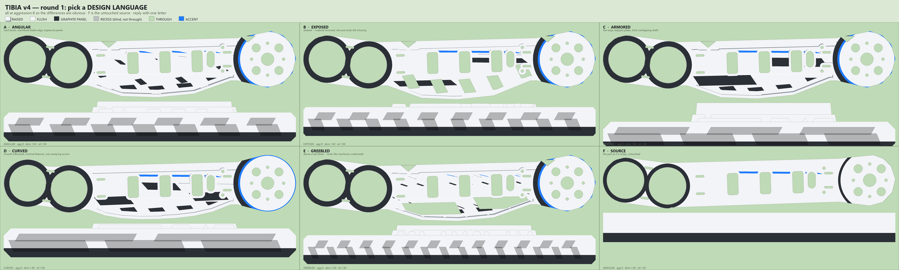

**Chose:** B+C crossbreed (exposed x armored)

**Said:** Likes B and C - they have large, readable details. Rejects A, D, E: details far too small, hard to see. For C: feature COUNT/density is right, but each feature should be bigger - bigger blue squares, bigger graphite squares. Wants MORE blue accent than currently, and the blue made cohesive - following a line or some logic, because right now the blue reads as random lines scattered here and there.

---

## 02 · round 2 - crossbreed axes
*2026-09-18*

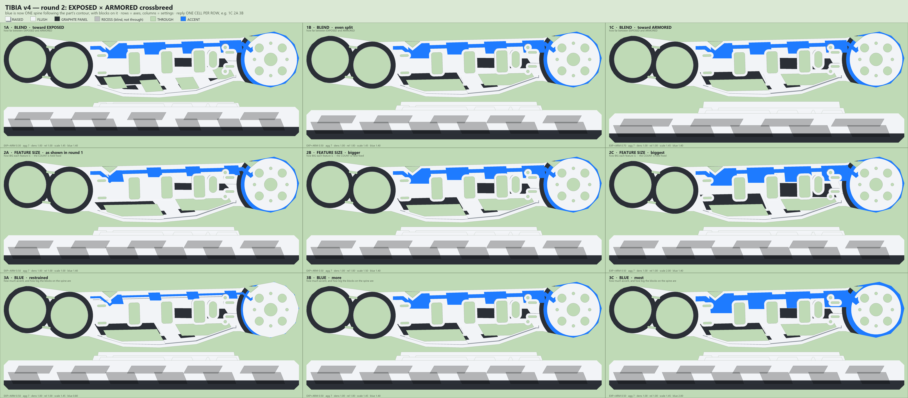

**Chose:** 2B + 3A, blue split midway (accent ~1.1); blend held at even 0.5

**Said:** Likes 2B best - the larger cutouts/features are 'probably the style I'm going for'. Likes the blue QUANTITY and SUBTLETY of 3A; wants blue midway between 2B (1.4) and 3A (0.8), so ~1.1. Did not call a row-1 cell, so the even 0.5 exposed/armored split stands. NEW DIRECTION, the big note: 'you're doing it only in one direction' - all silhouette growth so far is the keel on -Y only. He wants the OUTLINE changed on ALL sides, adding larger features around the whole perimeter, so the part reads as a different shape from the original. Only hard constraints are the circles (the bores at E, C, W).

---

## 03 · round 3 - outline all sides
*2026-09-18*

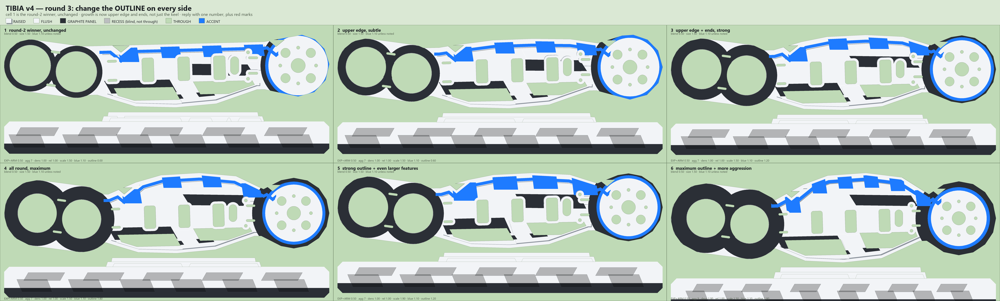

**Chose:** 1 (unchanged) - rejected all the round outline growth

**Said:** Cell 1 still the favourite; 2-6 'just look fat'. Rejects the SHAPE of the growth, not the idea: 'the outline that you added is too round - you need sharper creases or trapezoidal lines'. Annotated the board with a red polyline over BOTH the top and bottom edges: straight horizontal runs joined at sharp vertices, two plateaus per edge with a step between them, angled ramps at the ends. That is the target silhouette language. Second note: 'the fat black circles also don't look very good' - the graphite collars around the E/C/W bores are too thick. Wants NON-CIRCULAR features next to the bores: 'a little square-like thing, or one edge'. Fatness came from outline inflating the round knee/wheel lobes - that inflation is being dropped.

---

## 04 · round 4 - creases and circles
*2026-09-18*

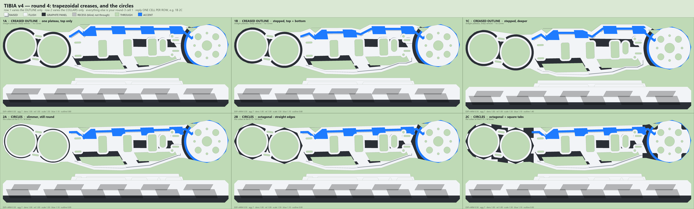

**Chose:** 1B + 2A

**Said:** 1B (stepped trapezoid creases, top AND bottom) is the best - 'the creases are OK, they're getting to the right shape'. So the absolute-Y straight-plateau approach is correct and the fatness complaint is resolved. For the circles he picked 2A - the SLIM ROUND collars - over the octagonal (2B) and the tabbed (2C). He called them 'the thin black circles' and likes them as-is, so the non-circular/square-tab idea from round 3 is dropped: slimming them was what he actually wanted. NEW IDEA: 'maybe we can adopt those somewhere else' - reuse the thin graphite ring motif as a surface feature elsewhere on the part, not only at the E/C/W bores.

---

## 05 · round 5 - ring motif reuse
*2026-09-18*

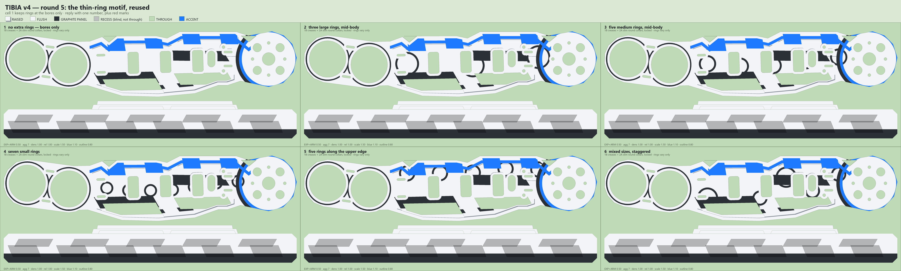

**Chose:** 1 - no extra rings, bores only

**Said:** 'The thin circles only work on the bores, not anywhere else in the part.' The motif is location-specific: it reads as a bearing collar because it sits on a bearing, and loses that meaning as free-floating surface decoration. n_rings stays 0. TIBIA IS SETTLED at: exposed x armored 0.50 blend, aggression 7, density 1.0, relief 1.0, scale 1.5, accent 1.1, outline 0.8 (stepped trapezoid creases top and bottom), slim 2.0 mm round collars.

---

## 06 · built tibia - reference-art critique
*2026-09-18*

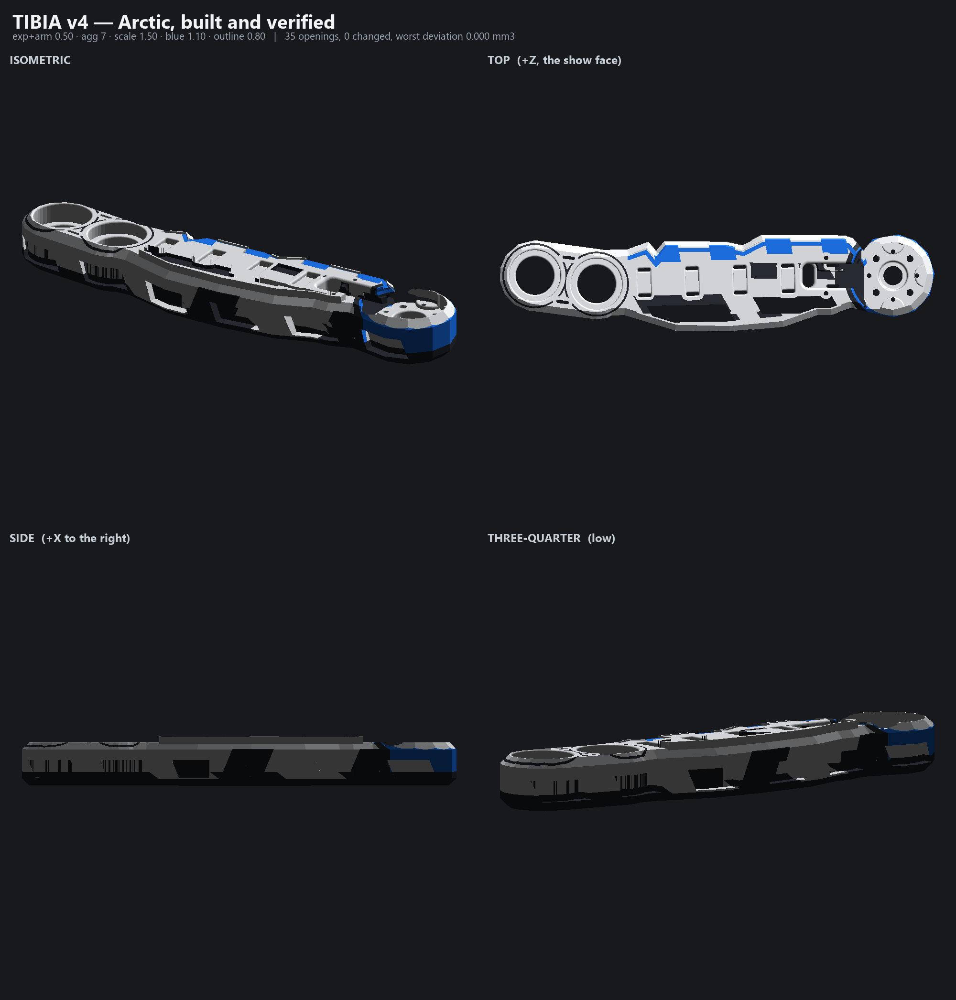

**Chose:** REOPENED - does not match the concept art

**Said:** Attached the concept-art robot photo with the whole LEG circled in red. 'The accent and details seem random and not fluid or cohesive like in the attached picture.' Readable differences: (1) reference limb is one or two LARGE unbroken light panels, ours scatters small pads/pockets evenly along the length; (2) reference blue is a SINGLE narrow tapered stripe running LENGTHWISE along the limb axis, ours runs around the perimeter contour and is broken into blocks; (3) reference blue always sits INSIDE a dark recessed channel, never directly on white - that border is what makes it read as a light strip rather than paint; (4) reference graphite reads as MECHANISM showing between covers at the joints, ours comes from an arbitrary Z-split plane. Colour in the reference follows function: white = outer shell, dark = structure underneath.

---

## 07 · round 6 - match the concept art
*2026-09-18*

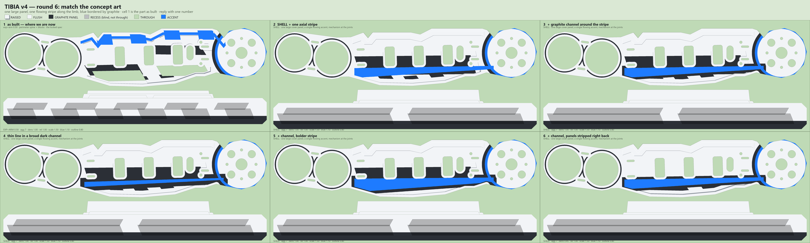

**Chose:** 1's blue LINE, but organised + 4's dark channel

**Said:** Keeps the as-built geometry and the as-built blue LINE (cell 1, the upper perimeter spine) rather than the new keel-running axial stripe. Two changes wanted: make that line 'less jagged / more organised', and give it the graphite CHANNEL border from cell 4. Then asked to be shown MULTIPLE DIFFERENT TYPES of line / accent detail - so the next board is a variety board of accent treatments, not another amount sweep. Note the jaggedness source: the spine is built with band_along() off , so it inherits every step of the trapezoid crease outline.

---

## 08 · round 7 - kind of line
*2026-09-18*

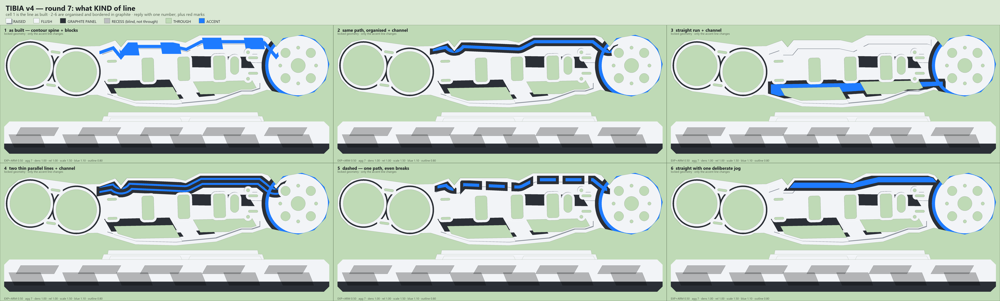

**Chose:** none - redirected to artistic concepts/

**Said:** Pointed at 'artistic concepts/' (two sheets added 2026-09-18 13:29-13:30, Ascento-style build guides). 'We are still missing something related to the desired aesthetics... tweak the ORGANIC lines and details to match that vibe.' The reference 'Leg Link (Lower)' is the tibia's analogue and it is WAISTED: wide circular boss at each end, necked-in slender shaft between, every boss-to-shaft transition a smooth TANGENT CURVE - no steps, no hard vertices. Long tapered stripe down the shaft, concentric rings at the joints. So the gap is the SILHOUETTE, not the accent line drawn on it. Note the tension: round 4 he chose hard trapezoid creases over round ones; the reference is the opposite, so the new board must show both. Also: the reference palette is white #E6E6E6 / secondary blue-grey #6B72B0 / accent #00A8FF - that secondary is FAR lighter than our near-black graphite #2B2F36, which is likely a second contributor to the 'vibe' gap.

---

## 09 · round 8 - organic waisted link
*2026-09-18*

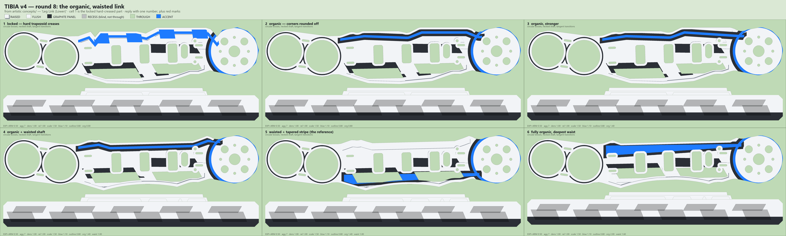

**Chose:** 2's rounding (organic 0.8, no waist); accent rejected again

**Said:** Likes 'the outside rounded corners of 2' - so organic=0.8, the MILD rounding, and he did NOT take the waist. ACCENT REJECTED for the 4th time, and this is the useful sentence: 'it just looks like a line. perhaps just elongated trapezoids? wanna give futuristic vibes.' So a continuous stroke is wrong in kind - the accent must be DISCRETE elongated trapezoids, the same vocabulary as the cutouts. 'The trapezoidal cutouts give the correct vibe' - the dark trapezoid pockets are right and should stay. Reconciles with the round-1 'random blue lines' note: discrete trapezoids are fine as long as they share one axis and one skew. COLOUR UNLOCKED: 'feel free to change colors, dark grey to light grey if that is what you need' - so the near-black graphite #2B2F36 can move toward the concept's lighter blue-grey.

---

## 10 · round 9 - trapezoid accent + light palette
*2026-09-18*

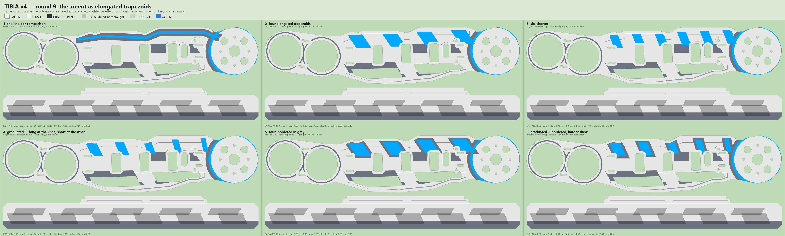

**Chose:** direction approved, no cell picked - wants more shape options

**Said:** 'Much better' - the elongated-trapezoid accent and the lighter concept palette (graphite #6B7280, accent #00A8FF) are both approved in principle. Did NOT pick a cell; asked to see other accent SHAPES inspired by five HUD/sci-fi frame reference sheets he attached. Explicitly: 'doesn't have to be closed frames, just the inspiration.' Vocabulary readable in those refs: chamfered elongated hexagons/lozenges, chevrons and arrow stacks, groups of parallel diagonal hatch slashes, L-shaped corner brackets, thin bars with perpendicular tick marks, and lines that step once and continue. All OPEN shapes sharing a common axis - consistent with the trapezoid row that just worked.

---

## 11 · round 10 - HUD accent shapes
*2026-09-18*

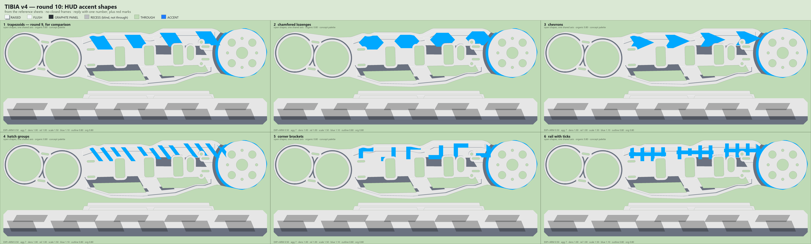

**Chose:** none - redirected to circuit-trace language

**Said:** Three cyber/circuit-trace reference images. Wants: 'lines that take trapezoidal turns every once in a while, with perhaps the blue following the dark grey at some points, circuit board looking.' Readable vocabulary: (1) long MOSTLY-STRAIGHT runs that jog diagonally to a new level and continue - a circuit trace, not a row of discrete elements; (2) a thin accent trace running PARALLEL and adjacent to a wider dark-grey trace, so the blue accompanies the grey rather than sitting alone - and only over part of the length, not everywhere; (3) small groups of 3 parallel hatch slashes at intervals along the traces; (4) chamfered/45-degree trace ends. Distinct from round 9/10 which were discrete repeated elements; this is ONE continuous routed path with occasional level changes.

---

## 12 · solo run - 62 concepts
*2026-09-19*

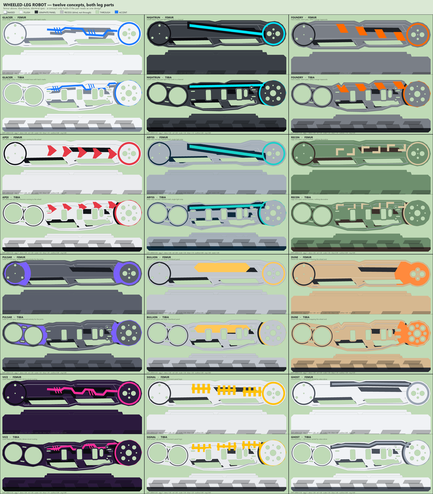

**Chose:** pending - awaiting his pick

**Said:** Three hours of full creative liberty. Produced 62 concepts on 11 boards across BOTH leg parts, 18 of them built in 3D and verified (0 openings changed, 0.000 mm3 each). Implemented all ten palettes from the concept art's own sheet 5 plus six more; built 18 accent styles; added organic/waist silhouette axes; made the Femur a second part on the same system. Best single board: gal_legset.png - femur and tibia per concept, because a concept only holds if the pair reads as one design. Index in CONCEPTS.md. Nothing locked to specs/.

---

## 13 · solo run - final pick
*2026-09-19*

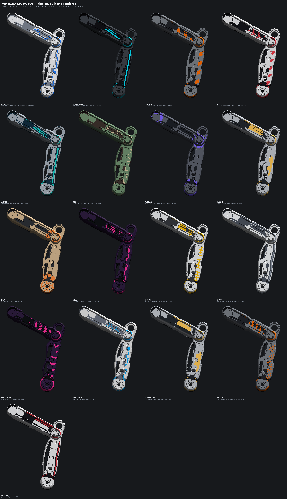

**Chose:** GLACIER

**Said:** 'Glacier looks really good - that's the aesthetics we're going for.' LOCKED for both parts. GLACIER = 01 Arctic body with the softer/lighter structural grey (arctic_lt: white #F2F4F7, dark #7E8795, accent #1E7BFF), exposed x armored 0.50 blend, aggression 7, density 1.0, relief 1.0, scale 1.5, accent 1.1, outline 0.8 (stepped trapezoid creases top and bottom), organic 0.8 (mild rounding), collar_t 2.0 slim round collars, accent_style circuit (routed trace with trapezoidal jogs, grey companion trace alongside over part of the run, two hatch groups). Moving to the next phase: he will share all remaining STEP files.

---

## 14 · phase 4 - assembly arrived, scope and show face
*2026-09-19*

**Chose:** Femur rebuilt MIRRORED; scope = Coupler, Side panel, EncoderCarrier + EncoderCableClamp + Switch_Mount; Femur_inside_InsideBox is the mirrored LEFT femur; Mount/WheelHanger/AK_SIM are DEAD

**Said:** No board - answered from the assembly analysis. (1) SHOW FACE SETTLED, and it is NOT uniformly +Z. Walking Extended.STEP transforms: the hip axis is global Z and increasing global Z is OUTBOARD (wheel outermost at Z 169-203, RobotMount innermost at 80-99). Tibia local +Z -> global +Z, so the tibia is correct as built. Femur and Coupler local +Z -> global -Z, so their show face is local -Z. He chose to rebuild the Femur mirrored rather than leave it: same GLACIER geometry, features land on the other side. Needs a show_face parameter in the spec, NOT a redesign. (2) SCOPE: Coupler, Side panel, and the three small brackets (EncoderCarrier, EncoderCableClamp, Switch_Mount). Wheel rim explicitly NOT taken - it is a disc and would need a radial variant of the linear band code. (3) Femur_inside_InsideBox is the MIRRORED LEFT-SIDE FEMUR, not a separate part - it inherits the Femur treatment mirrored, it does not get its own recipe. (4) Mount, WheelHanger and the whole AK_SIM family (AK_SIM, Ak sim rotor, ak sim body, Plug_Ak45sim) are DEAD - leftovers, referenced by none of the three pose assemblies. Do not style them.

---

## 15 · step export - case collision lost two parts
*2026-09-19*

**Chose:** recovered by XCAF extraction from Extended.STEP, no re-export requested

**Said:** Coupler.STEP and "Side panel.STEP" do not exist in "Middle multiple parts/". SolidWorks wrote the ASSEMBLY nodes COUPLER.STEP and "SIDE PANEL.STEP" (0 faces, structure only) and Windows being case-insensitive those filenames blocked the real parts. SwicthMount/Switch_Mount escaped only because the spelling differs. Both parts were pulled out of Extended.STEP via STEPCAFControl_Reader + XCAF in 23 s into input/parts/. DATUMS CROSS-CHECK EXACTLY against CLAUDE.md: Coupler has 4-bolt crosses at x=-84.770 and a Dia26 bearing bore at x=+84.770, 169.54 mm apart = |EF|; the -84.77 end carries a 7 mm-arm bolt cross identical to the Side panel's, so -84.77 is F (body pivot) and +84.77 is E (tibia end). Side panel origin IS A (five holes on the Dia45 AK45-10 stator circle) and its 7 mm cross sits at (-36.420, +37.540), giving |AF| = 52.30 mm - CLAUDE.md verbatim. Both silhouettes come back as ONE polygon, so trap 9 bridging is not needed for either. If the export is ever redone, rename the assembly nodes or export to separate folders or these two vanish again.

---

## 16 · colour split made part-relative, target 70 percent white
*2026-09-19*

**Chose:** white_share replaces split_z; target 0.70 on Tibia, Femur and Coupler; three-value palette kept

**Said:** Prompted by the high res render in artistic concepts/, which he said conveys the aesthetic exactly except for the green. THE DEFECT: split_z is an ABSOLUTE z and does not transfer between parts. It sits 18.5 mm below the Tibia show face, the full 39 mm on the Femur and only 10 mm on the Coupler, so the Coupler came out 28.6% white against the Femur 61.4% - nearly inverted, a dark part between two light ones. Same defect as trap 10, one axis over. FIRST FIX FAILED: white_depth, a fraction of thickness, gave the Coupler 42% and the Femur 74% at the same 0.72 - depth does not map to volume because the cross-section varies through the part. SHIPPED FIX: white_share states the TARGET SHARE and bisects for the split plane; this is the white_share dial TOURNAMENT.md deferred until geometry settled. Coupler tops out at 65%, not 70 - the accent, collars and pocket insets claim the rest even with the plane at the far face. That is a ceiling of the part, not a tuning failure. PALETTE: the reference names FOUR values (matte white, matte mid grey, matte dark grey, gloss blue) where GLACIER has three. He chose to KEEP THREE and not reopen the look. Noted that a fourth filament is not free on the X2D dual nozzle - the third colour already purges, a fourth purges again.

---

## 17 · collisions - clip growth to free space
*2026-09-19*

**Chose:** clip growth against an assembly-derived keep-out, 1.0 mm clearance; port the Tibia too

**Said:** lib/collide.py found 25 NEW collisions caused by styling, across all three poses. Worst: Femur x Tibia 12969 mm3 and Coupler x Tibia 11556 mm3 in Retracted, which is the Q_RET +28 deg hard stop, so the three poses do bracket the travel rather than missing the extreme between samples. Also Femur x Coupler up to 6307, Femur x AK45-10 Stator ~1950, Coupler x AK45-10 Stator 1339, Tibia x wheel Stator 792. CAUSE: the three links share lateral bands (Coupler global Z 111-146, Femur 123-162, Tibia 123-150) and clear each other IN PLAN only, with little margin. Styling grew each part 6-13.5 mm in plan and +3.5 mm in Z - the raised frame stands proud of the show face because frame_h 7.86 exceeds the 4.38 chamfer. The motor hits are different: the hip stator is a D53 cylinder at the origin and the end bosses grew out over it. CHOSE prevention over reduction: lib/asmkeepout.py derives, per part and per pose, where the metal may not go, and plan() subtracts it from the grown outline before the envelope is built. Rejected turning growth down globally (thins the look everywhere including where there is room) and growing outboard only (drops the trapezoid outline growth chosen in round 4). TIBIA: he asked for it to be ported. Done NARROWLY on purpose - backported white_share, the keep-out clip and the silhouette guard, but LEFT ITS BAND LAYOUT ALONE. Generating it from femur.py would move every feature band (frame x 64-192, pads 66-194, split fingers (58,102)/(138,182)) onto the femur fractions and silently redesign a part approved in decision 05. Flagged to him; the full regeneration is still open if he wants it.

---

## 18 · the styling was cutting into the source part - pre-existing
*2026-09-19*

**Chose:** clamp env to contain prism(OUT, ZB, ZT); verify.py now measures source material removed

**Said:** FOUND while checking why the collision-clipped Femur came out SMALLER than its source (74.73 vs 86.74 cm3). The 4.4 mm chamfer bevels the outer edge of the grown outline, and body = union(...) & env means that wherever growth is thinner than the chamfer the bevel lands on the SOURCE and cuts it away. MEASURED, clipped build: Femur 21594 mm3 / 24.90%, Coupler 15129 / 20.37%, Tibia 31973 / 14.02%. THE COUPLER WAS NET BIGGER (80.56 vs 74.27) while losing a fifth of its original material - net volume hides this completely. AUDIT OF THE APPROVED PARTS, unclipped, i.e. the configuration locked in decision 13: Femur 14320 mm3 / 16.51%, Tibia 29092 mm3 / 12.75%. So this is PRE-EXISTING; the collision clipping only made it worse and visible. It went undetected because verify.py tested OPENINGS ONLY: every one of these builds reports 0 openings changed, worst deviation 0.000 mm3, because no bore happened to sit where the bevel ran. The brief has always said material is only ever ADDED outside the original silhouette; nothing tested it. FIX: verify.py now prints 'source material REMOVED' on every run, and env is clamped with prism(OUT, ZB, ZT) so the bevel can only ever touch added material. Cost is a square original edge wherever growth is thinner than the chamfer. He chose clamp-now-then-z-layer; z-layered growth is the way to get the growth, and therefore the chamfer, back.

---

## 19 · CORRECTION to 18 - most of that removal is deliberate
*2026-09-19*

**Chose:** the clamp stands; the metric in 18 was measuring the approved look as if it were a defect

**Said:** Entry 18 reported 14-32 cm3 of 'source material REMOVED' per part and called it a violation of 'material is only ever ADDED'. That framing is WRONG and this entry supersedes it. build() removes source material in FIVE deliberate places - pockets, windows, full-depth trapezoid cutouts, side-wall pockets and the accent engraving - and those are the GLACIER look: he chose the trapezoid cutouts explicitly in decision 09 ('the trapezoidal cutouts give the correct vibe') and decision 00 records 'silhouette reshaping allowed; stiffness explicitly not a concern'. The metric added to verify.py summed ALL removal, so the 16.51% on the approved Femur and 12.75% on the approved Tibia are mostly his own approved features, not a hidden defect. WHAT SURVIVES from 18: the ENVELOPE had no business cutting the source - it exists to bound ADDED material, and wherever growth fell below the 4.4 mm chamfer it bevelled the real part. That is now measured on its own in build(), as solid - env, where env is actually in scope, instead of being inferred from a whole-part volume delta. verify.py's number is relabelled as a TOTAL with its components named so it cannot be misread the same way again. The env clamp - env = union(env, prism(OUT, ZB, ZT)) - stays: it costs a square original edge where growth is thin and makes the guarantee structural rather than a tolerance that holds while growth exceeds 4.4 mm.

---

## 20 · paint on a pig - added material must read as structure
*2026-09-20*

**Chose:** growth becomes ONE FLANGE, placed where it can attach; all five parts grow, zero collisions

**Said:** HIS CALL, on a render of the Femur seen end-on: the original part was there with two thin full-depth walls stuck to its sides. 'The aesthetics are really good. But the part doesn't look functional... it looks fake.' Then, when I over-corrected to fully subtractive: 'The whole idea was for you to be able to add material. Just add in a way that makes aesthetic and collision free sense.' ROOT CAUSE: out_h is 4.5 mm and the Femur is 39 mm deep, so growth extruded over the full depth is a 1:9 FIN. Confined to the outer third it is a 1:2.8 flange and reads as a thickened edge. I ALSO CONCLUDED WRONGLY, mid-session, that the robot had no room to grow at all -- the free-space survey (scratchpad/freespace.py) disproved it: a 6 mm band outside the silhouette is 85% clear on the Tibia, 41-74% on the others, 20-28% on the Femur. What is blocked is the PIVOTS, which is exactly where `bosses` tried to grow, so the only growth that ever survived came through as one lone sliver. The shaft edges were open the whole time. FOUR SHAPES WERE BUILT AND MEASURED BEFORE ONE WORKED: (1) full-depth band = the fin; (2) per-layer tapered bands -- each starts at the SILHOUETTE while the real cross-section at depth is smaller, so it fused to nothing and the Coupler threw away its whole 13.8 cm3 flange; (3) per-layer bands grown from each band's OWN section -- the section changes with depth so every band juts out somewhere different: a stack of SHELVES, 44 cm3 of trays; (4) one prism pinned to the show face -- fine on the links, but a plate whose top face is recessed has its RIM lower down, so the ring had no metal to attach to and was dropped whole. SHIPPED: one prism, width from the spec, placed at the show face if it attaches there and otherwise at the band holding the most metal. RESULT: every part grows (Femur +8.0 mm Y, Tibia +12.6, Coupler +6.2, Side panel +7.2, RobotMount +6.0), all five verify 0 openings changed / 0.000 mm3, and collide.py reports NO NEW COLLISIONS in any pose. CAVEAT HE SHOULD KNOW: on the Coupler, Side panel and RobotMount the flange lands on the INBOARD face, because those parts have no metal at their show-face perimeter. Material is added and it is structural, but it is not seen. Opening that up means loosening the keep-out (PAD_Z 6 mm, 1.0 mm clearance, neighbours taken at maximal styled size) -- margin he chose, so his call.

---

## 21 · bugs found by looking at renders, not at numbers
*2026-09-20*

**Chose:** five defects, each invisible to the checks that existed

**Said:** Recorded because every one of these passed the verification of its day. (1) verify.py had TRAP 7 IN IT -- import_step(styled).solids()[0] measured ONE fragment of a multi-solid body. Every part built that day is multi-solid (Femur 2, Coupler 2, Tibia 4, Side panel 3, RobotMount 2). The Side panel read 0.39 cm3 against a 92.01 cm3 source and reported nine false 'changed' openings, while a genuinely broken part could have passed. (2) THE ENVELOPE WAS EATING THE SOURCE: `union(solid, add) & env` lets the 4.4 mm chamfer bevel the real part wherever growth is thinner than the chamfer -- 14-21 cm3 per part. The Coupler was NET BIGGER while losing a fifth of its original metal, so a volume delta hid it completely, and an openings-only check saw nothing because no bore sat where the bevel ran. Fix: `union(solid, add & env)`. (3) RAISED PADS EXTRUDED FROM A FIXED Z floated wherever the real surface sat lower -- a detached plate with two prongs under the Coupler. Fix: clip to _top_face(). (4) `_clip` ends with ShPoly(...exterior), which DISCARDS INTERIOR HOLES, so a neighbour whose keep-out fell inside the growth region had its hole filled straight back in. That let the Tibia drive 1363 mm3 into the Coupler beside their shared pivot in all three poses -- identical in every pose, which is what gave it away. (5) THE FLANGE INHERITED THE WIDTH OF THE WHEEL BOSS: I used Wmax, the part's maximum growth anywhere, as the uniform flange width, so the Tibia's edge flange came out 16 mm instead of 7. THE LESSON: renders caught 1 and 3; the collision sweep caught 4 and 5; the 'filament bodies must sum to the part' guard caught a 3MF holding 20 cm3 of a 125 cm3 part. None of these were caught by the check that was supposed to cover them. Guards now in build(): envelope removes nothing, fuse loses no volume, filament bodies partition the part, detached pieces reported WITH THEIR BBOX, flange funnel printed as ring -> design -> clear -> attached.

---

## 22 · restart - STEP output must be trustworthy in SolidWorks
*2026-09-20*

**Chose:** measure SolidWorks instead of guessing: automate its COM API as the referee

**Said:** PHASE RESTART, his call. Three things wrong with where the aesthetics work stands, to be fixed IN ORDER. (1) THE OUTPUTS DO NOT RENDER. The 3MF is mostly right in Bambu Studio but the STEP is wrong in SolidWorks - he sent a screenshot of the Femur with a thin tapered blade standing perpendicular off the pivot boss, circled. He reports the TIBIA as the only part that renders correctly; not the Femur, and NOT because it was first - the Tibia is the one part deliberately NOT generated from femur.py. (2) HE WILL GIVE THE ASSEMBLY CONTEXT BY HAND. Deriving prime surfaces, add/remove candidates and tight tolerances from the assembly STEP alone produced wrong answers; he will mark up screenshots instead. Method still to be agreed. (3) THEN REBUILD THE PARTS with explicit constraints: no collisions over the range of motion, no thin walls, no fragile sharp features, NO FLOATING BODIES, and the back face must carry the same robotic aesthetic as the front rather than bare grey squares and stray lines left by the colour split. WHAT I MEASURED BEFORE TOUCHING ANYTHING, by reading the written files back through XCAF: the geometry in every *_colour.step is COMPLETE and valid - read-back totals match the build to three decimals (Femur 78.556, Tibia 211.354, Coupler 65.186, Side panel 89.987, RobotMount 107.069 cm3), zero invalid bodies, every body carries its colour. So the defect is STRUCTURE, not geometry. FOUR FINDINGS. (a) stepcolor.py writes every solid as its own ROOT PRODUCT with ZERO assembly structure - 21/21/27/23/42 unrelated roots per file. Deliberate, to dodge an importer that showed only one solid of a compound; it traded one failure mode for another. (b) Needle bodies: RobotMount has 31 solids 0.01-0.5 mm wide by 5 mm tall, Side panel has one 0.01 x 0.03 x 20.5 mm. I first claimed these correlated with the part that works and RETRACTED it - the Tibia is the good part and it has a needle of its own (accent_5, 0.64 x 0.28 x 25.8 mm). Real defect, not proven to be the cause. (c) FLOATING BODIES ARE REAL AND THE CAUSE IS KNOWN: the fused Coupler is five disconnected solids - the part plus four chunks totalling 1.15 cm3 at ~21 x 5 x 7 mm each; the Femur has one of 0.025 cm3. The detached-piece guard runs at femur.py:699 but the raised frame/rail/pads are unioned on at :730 and the flange later still, so anything stranded after :699 is never checked. That is his floating-features complaint, with a line number. (d) The fused Tibia has THREE SEALED INTERNAL CAVITIES totalling 1.41 cm3, two of them 36 x 7 mm bubbles - unprintable and unreachable. HIS ANSWERS: automate SolidWorks; Tibia is the good part; symptom is bodies missing; ship whichever file form SolidWorks handles best. DECIDED: stop reasoning about what SolidWorks does and make it answer. SOLIDWORKS 2023 (31.5.0.0052) is installed here and its COM ProgID is registered, so tools/swcheck.ps1 now opens a STEP through the SolidWorks API and reports the body list SolidWorks actually built, with volume and colour per body, plus an isometric PNG. The pipeline has never been able to see inside the one viewer that matters.

---

## 23 · PHASE 1 SOLVED - the STEP was non-manifold, and Parasolid shatters those
*2026-09-20*

**Chose:** weld a 0.06 mm rod along every pinch edge; stepcolor.py now welds, writes ONE root, declares honest tolerance

**Said:** ROOT CAUSE, confirmed by him in SolidWorks: the Femur's graphite_1 had FOUR NON-MANIFOLD EDGES - vertical lines the full 9.875 mm feature depth with FOUR planar faces meeting along each. The body touched itself. OCC represents that happily and BRepCheck_Analyzer calls it valid; PARASOLID (SolidWorks, NX, Solid Edge) CANNOT REPRESENT A NON-MANIFOLD SOLID AT ALL, so on import it splits the body at every self-contact. He measured it: one 17.68 cm3 body became 30 SOLID BODIES AND 11 SURFACE BODIES TOTALLING 0.00 cm3, with NO ERROR RAISED, because splitting is a legitimate repair from its side. The part read as hollow - white cylinder base present, grey cap simply gone - and his own observation 'the grey portion of that cylindrical feature doesn't render, I only see the white portion' is what localised it to a single body. WHERE IT COMES FROM: buffer(0), used in about a dozen places in the 2D layer. It makes a self-touching ring OGC-valid by splitting it into two lobes THAT STILL TOUCH AT A POINT; extruding that gives two prisms sharing one vertical edge. The bug is upstream of every boolean, in the plan geometry, which is why nothing downstream could see it. FIVE HYPOTHESES WERE WRONG AND EACH WAS KILLED BY A TEST, three of them by him opening files I built: (1) the 21-42 unrelated root products - he opened roots and multibody builds of identical geometry and got IDENTICAL failure; (2) dirty micro-geometry - white_1 has 179 sub-0.01 mm2 faces and tol 4e-4 against graphite_1's 49 and 5e-5, and white_1 imports fine; (3) self-intersection - graphite_1 CLEAN, white_1 self-intersects AND IMPORTS; (4) thin walls from the colour split - graphite_1 mean wall 2.108 mm; (5) the declared STEP tolerance being 270x too tight - true and now fixed, but rewrites at 5e-5, 1e-3 and 1e-2 mm all failed identically. On EVERY metric the body that imports is worse than the body that fails, which is what finally forced the check nobody had run: edge-face incidence. REPAIRS THAT DO NOT WORK, recorded so they are not retried: ShapeFix_Shape and ShapeUpgrade_UnifySameDomain are both no-ops here (1404->1404 faces on white, 723->723 on graphite), and BRepBuilderAPI_Sewing with non-manifold mode OFF preserves volume exactly and leaves all four bad edges. WHAT SHIPPED: lib/manifold.py detects non-manifold and free edges and welds each pinch with a 0.06 mm rod - which is also the right MECHANICAL answer, since a knife-edge contact carries no load and is exactly the fragile sharp feature the brief rules out. lib/stepcolor.py now welds every body, writes ONE root product instead of one per solid, declares the shape's true worst-case tolerance, and REFUSES to write a body that is still non-manifold after welding. tools/reexport.py repackages all five parts from the per-filament STEPs with no rebuild. RESULT, all five: non-manifold edges 0, volume within 0.0025%. HE CONFIRMED the Femur in SolidWorks - 17 solid bodies, 0 surface bodies, 78,556.63 mm3, grey cap present: 'bingo that looks beautiful'. BAMBU IS NOT AN INDEPENDENT WITNESS - it imports STEP through OpenCascade, the same kernel that wrote the file, so it reproduces OCC's interpretation by construction and will always agree; only a Parasolid consumer tests portability. SOLIDWORKS COM AUTOMATION was built, then scrapped at his request - he checks files himself and sends screenshots. pywin32 is installed in cadenv and otherwise unused. STILL OPEN and handed to Phase 3: the 2D buffer(0) pinch cause (welding is a repair, not a fix), the per-filament print STEPs are still unwelded and will shatter, the Coupler's 4 floating chunks / 1.15 cm3 (guard runs at femur.py:699 but raised features union on at :730), the Tibia's 3 sealed cavities / 1.41 cm3, and RobotMount's 31 needle solids - now dropped at export as debris under 1 mm3 but still produced by build(). verify.py has now been insufficient THREE times; HANDOFF.md specifies the manifold gate that would have caught all of this.

---

## 24 · phase 2 - markup protocol agreed
*2026-09-20*

**Chose:** RED = may REMOVE, GREEN = may GROW, unmarked = leave alone; Middle pose, 6 assembly views; per-part sheets too

**Said:** HIS LEGEND OVERRIDES HANDOFF.md, WHICH SAID THE OPPOSITE. HANDOFF.md Phase 2 specified GREEN = may add, RED = DO NOT TOUCH, BLUE = may remove. He asked for two colours with RED meaning REMOVE, which is the inverse of the written protocol on red. Reading a sheet under the old legend would cut material exactly where it must never be touched. TWO COLOURS ONLY: red = material may be removed, green = material may be added (annotate mm, e.g. +6). ANYTHING UNMARKED IS LEFT ALONE and the derived keep-out from lib/asmkeepout.py still applies there, so silence is conservative rather than permissive - which is why a third 'do not touch' colour is not needed. He declined marking sacred faces positively; bearing/mating/fastener seats will be identified by the absence of a mark plus the direct questions in Phase 2. POSE: Middle only, six axis-aligned views. He accepted the risk that clearance is pose-dependent and that Retracted is where collide.py found the worst interference - any growth he approves still has to survive the three-pose sweep before it ships, so the sweep is the backstop, not his marks. SCOPE: both sheet sets in one build - the six assembly views for context and crowding, plus one sheet per part (show face, BACK face, both end-on, unstyled flat grey, mm grid) because the back of every part is hidden inside the assembly and 'the back must carry the same aesthetic as the front' is his own Phase 3 requirement.

---

## 25 · phase 2 - his marks read, scope cut to the links
*2026-09-20*

**Chose:** GREEN = perimeter band grown through the FULL LOCAL SECTION; RED = central web, pockets mostly and through-cuts only in small areas; min_wall 3.0; scope = Femur, Tibia, Coupler only

**Said:** HE MARKED FIVE SHEETS into input/human feedback/ and they read as ONE coherent instruction: thicken the rim, hollow the middle, do not touch the bosses. GREEN is a BAND FOLLOWING THE OUTER PERIMETER of each link along both +-Y edges for most of its length - NOT blobs. RED is the CENTRAL WEB, and in every case it stops well short of the pivots: Femur x -73..63 of a part spanning -113..111, Tibia x 63..158 of -21..245, Coupler x -45..60 of -102..107. That is an I-beam, and it agrees with the GLACIER skeletal language. HE CAVEATED THE MARKS HIMSELF: 'it was a little tricky to show you exactly where things could be added or removed... I'm not going to say take them with a grain of salt but it's a suggestion... obviously the collision-free check at the end will have to pass.' So the marks are intent, not gospel, and collide.py over three poses remains the gate. MEASURED REACH BEYOND THE SILHOUETTE, since he annotated no distances: Femur median 2.5 p90 5.0 max 7.3 mm; Tibia median 2.7 p90 5.7 max 9.4; Coupler median 1.7 p90 3.2 max 5.7. Red is essentially all ON the part (<=1 mm spill), confirming the removes are interior pockets and not silhouette changes. HIS THREE ANSWERS. (1) REMOVE DEPTH: 'it could go all the way through or partially, all the way through would reduce part strength so only do that in certain small areas' - so pockets are the default and through-cuts are reserved for SMALL windows; a size threshold is needed and is mine to propose. (2) GROW DEPTH: FULL LOCAL PLATE THICKNESS. The word that matters is LOCAL: growth at a perimeter point runs through the part's ACTUAL SECTION AT THAT POINT, not the bbox depth. This is what kills the fin automatically - the Femur's 39 mm is a bbox, and its section at the rim is far thinner, so a rim through the local section is a proportionate flange rather than the 1:9 blade of decision 20. He was shown the fin risk in the question and chose this anyway. (3) MIN_WALL stays 3.0 mm, ~7 extrusion widths at a 0.4 nozzle. SCOPE CUT: 'let's not focus on the robot plates either as a side mount or the robot plate, let's just focus on the links for now.' Phase 3 is Femur, Tibia, Coupler ONLY; the Side panel and RobotMount zones his strokes clipped in passing are dropped, and Femur_inside_InsideBox is the mirrored left femur so its marks fold into the Femur. TOOLING FOUND TWO REAL DEFECTS. (a) He named the files add.png/remove.png, one colour per file, which no name-peeling resolves, so readmarks.py now identifies the sheet BY CONTENT - highest agreement on non-pen pixels among sheets of identical dimensions, with the agreement fraction printed because a confident match onto the wrong sheet would put every mark on the wrong part invisibly. It matched 97.9-100%. (b) THE BOUNDING BOX IS THE WRONG REPRESENTATION for a perimeter band: his Tibia halo wraps the whole part so its bbox IS the whole part, and feeding that to plan() would authorise growth everywhere - the exact inverse of what he drew. Marks must persist as POLYGONS in part-local coordinates. Related and worse: the zone reader keeps only ON-PART pixels, but for an ADD mark most of the meaningful area lies OUTSIDE the silhouette where the depth buffer holds nothing - that is where the new material goes. For an axis-aligned plan view the in-plane coordinates need no depth at all, so the plan polygons are built from (right,up) -> global XY -> local XY directly, and off-part pixels are attributed to the nearest part within a cap. ALSO NOTED: he saved his marked Coupler sheet OVER out/marks/parts/Coupler_end_Y.png in place; the sidecars were untouched so the mapping was unaffected, and the clean sheet is regenerable.

---

## 26 · phase 2 - marks are a seed, the collision check is the judge
*2026-09-20*

**Chose:** his marks give DIRECTION only; compute the real free space and let collide.py arbitrate; grow generously then carve back

**Said:** HE REDIRECTED, UNPROMPTED, RIGHT AFTER SENDING THE MARKS: 'the things that I drew are just kind of like suggestions of what I could gather... perhaps there's a way that you can find out exactly all the areas that you can add material or not, or just do a couple of trial and errors - even if you add material where I marked green, maybe you find out after a collision check and then you reduce it. I don't want you to take the things that I drew exactly like the Bible and written in stone. They're just suggestions or ideas of what I could see with my naked eye. But THE COLLISION CHECK IS THE ULTIMATE JUDGE of all of this.' THIS INVERTS THE PHASE 2 PREMISE and supersedes part of decision 24. HANDOFF.md said his map OVERRIDES the derived keep-out; it does not. His marks now carry INTENT - which edges, which regions, the I-beam idea of thickening the rim and hollowing the web - while the EXTENT is computed from the assembly and arbitrated by the collision sweep. Where the two disagree the geometry wins, in both directions: growth he marked that fouls gets carved back, and free space he did not mark is fair game to use. WHAT THIS CHANGES IN PRACTICE. The plan is no longer 'clip growth to his polygons'. It is: grow GENEROUSLY - well past his green - then subtract the actual interference, per pose, and keep what survives. That is exact rather than conservative, because the thing subtracted is the real overlap with the real neighbours rather than a guessed margin, and it directly attacks the two numbers he flagged as unmeasured guesses of his own: the 1.0 mm clearance and the 6 mm PAD_Z of decision 20. It also means the answer to 'how far can this edge grow' stops being a single flange width and becomes a distance that varies around the perimeter. NOTE ON POSE COVERAGE, the known weakness: collide.py samples THREE exported poses (Retracted, Middle, Extended). Decision 17 found the worst interference at Retracted, the Q_RET +28 deg hard stop, which is evidence the poses do bracket the travel rather than miss an extreme between samples - but it is not proof. The mechanism is a 1-DOF 4-bar and its geometry is fully documented in CLAUDE.md, so the transforms CAN be solved analytically at any hip angle and validated against the three exported poses to sub-0.1 mm. Start with the three real poses because their transforms are ground truth and need no kinematics; add articulated sampling only if three prove too coarse. HIS MARKS STILL PERSIST as input/marks/<Part>.json - add and remove regions as part-local WKT polygons, written by tools/markplan.py, with confirmed=false - but they are now an input to the search, not a constraint on it.

---

## 27 · phase 3 - the rebuild brief
*2026-09-20*

**Chose:** six hard constraints, links only, Femur first

**Said:** HIS WORDS, setting the definition of done for the rebuild: 'identified areas of adding and removing material, collision-free through the entire stroke of the robot, no floating pieces, no sharp edges, no very thin walls, and no silly kind of blocks of colour on the backside - the entire surface of the thing has to have this aesthetics.' SIX CONSTRAINTS, each with a check that must pass. (1) ADD/REMOVE ONLY WHERE IDENTIFIED - his marks give the intent, tools/freemap.py gives the extent, tools/reconcile.py puts them on one grid. (2) COLLISION FREE THROUGH THE ENTIRE STROKE - note 'entire stroke', not three poses. lib/collide.py samples three exported poses and MUST BE REWIRED to tools/kinematics.py, which places every instance at any hip angle across the 85 deg travel and is validated to 0.0000 mm. This is the constraint with real work left in it. (3) NO FLOATING PIECES - exactly one connected solid per body. Fails today: Coupler has 4 chunks totalling 1.15 cm3, Femur 1. The cause has a line number: the detached-piece guard runs at parts/femur.py:699 but raised features union on at :730 and the flange later still, so anything stranded after 699 is never checked. Move the guard to the end of build(). (4) NO SHARP EDGES - no knife edges, no zero-thickness self-contact, no needle solids. lib/manifold.py detects and welds; the 2D buffer(0) that CREATES the pinches is still in lib/asmkeepout.py and is the unfixed root cause. (5) NO VERY THIN WALLS - min_wall 3.0 mm, his number from decision 25, never yet measured on a finished body. (6) THE WHOLE SURFACE CARRIES THE AESTHETIC - the back is not a leftover of the colour split. CAVEAT WORTH KEEPING: some of the 'bare grey squares on the back' may have been the Phase 1 shattering rather than a styling failure, so look at the backs again in a welded export BEFORE treating it as an aesthetic problem. SCOPE stays links only - Femur, Tibia, Coupler. BUILD THE FEMUR FIRST and show him before the other two, because parts/femur.py is the general recipe every other part is generated from, so an error there propagates to all of them. HANDOFF.md was rewritten around this brief for the next session.

---

## 28 · phase 3 prep - the two gates his brief needs
*2026-09-20*

**Chose:** topology gate in verify.py; collide.py --sweep N over the whole travel

**Said:** BUILT BEFORE HANDING OVER, because the rebuild cannot judge its own work without them. (1) THE TOPOLOGY GATE. lib/manifold.gate() runs the four checks verify.py never had: non-manifold edges empty (Parasolid shatters a body that has them, silently), free edges empty (open shell), exactly ONE SOLID per fused body (his 'no floating pieces'), exactly ONE SHELL per solid (a second shell is a sealed internal cavity, unprintable), plus a needle/debris report under 1 mm3 or 0.5 mm thick for 'no sharp edges'. Wired into lib/verify.py, which now EXITS NON-ZERO on failure so it can gate a script. A per-filament body may legitimately be several solids - the accent comes out as separate traces - so one_solid=False there; the FUSED part must always be one. VALIDATION: run against today's parts it reproduces every number in the defect table independently - Coupler 5 solids with 4 floating pieces totalling 1153.4 mm3 at ~21x5x7 mm (recorded: 1.15 cm3, ~21x5x7), Femur 1 chunk of 25.2 mm3 (recorded 0.025 cm3), Femur graphite 4 non-manifold edges (recorded 4), Tibia 3 sealed cavities (recorded 3), Tibia non-manifold counts white 1 / graphite 2 / accent 2 (recorded white_2 1, graphite_4 2, accent_6 2). That exact agreement is the evidence the gate is correct. Also fixed parts/build_concepts.py, which unpacked verify's old 2-tuple and would have crashed, and now drops artifacts on a topology failure the same way it does for a moved hole. (2) THE SWEEP. lib/collide.py --sweep N places every instance at N hip angles across the WHOLE 85 deg travel via tools/kinematics.py, and REFUSES to run if that model does not reconstruct the three exported poses. Without --sweep it still does the old three poses, which is not what 'collision free through the entire stroke' means. COST WAS THE PROBLEM: every pair is an OCC boolean at ~1 s. Measured 10m03s for 3 configurations before, 5m32s after, with IDENTICAL findings; 21 configurations extrapolates to ~30-35 min, which is fine for a gate run once per rebuild. Three fixes bought that: source STEPs were being re-imported FROM DISK INSIDE THE INNER PAIR LOOP and are now cached; the styled boolean runs first and the source boolean is skipped whenever v_new <= TOL, since d = v_new - v_old with v_old >= 0 cannot then exceed TOL, which halves the booleans because most pairs clearing the bbox filter return zero; and --parts narrows the check to the parts being rebuilt. STILL MISSING: constraint 5, 'no very thin walls', has NO CHECK. A minimum-wall measurement on a finished solid is the one piece of his brief with nothing behind it, and HANDOFF.md says so rather than implying it is covered.

---

## 29 · phase 3 - thin-wall check scope and the through-cut threshold
*2026-09-20*

**Chose:** min_wall 3.0 on the FUSED part only; fail on a 10 mm2 patch; through-cuts <= 12 mm inscribed circle

**Said:** FOUR ANSWERS, given before the thin-wall checker was written. (1) MIN_WALL SCOPE: FUSED PART ONLY. 3.0 mm is a hard gate on the fused styled solid; the three filament bodies are NOT checked. He was shown that the colour bodies are far thinner than the fused part -- Femur graphite p1/p5 0.13 mm and 48% of its surface under 3 mm, white p5 0.50 mm, accent p5 0.09 mm -- because the colour split shaves skins off a solid that is itself thick, and he chose not to gate on that. CONSEQUENCE WORTH KEEPING: a 0.13 mm graphite skin is still a real slicing problem and nothing in the pipeline will catch it; that is now an accepted, named gap rather than an oversight. It also means the LOCKED GLACIER accent survives untouched, which the strict option would have forced a redesign of. (2) GATE RULE: a connected thin patch of 10 mm2 or more FAILS, or 50 mm2 of thin surface in total. Zero tolerance was rejected as unachievable -- a knife edge tessellates to finite-but-small and would block builds that are genuinely fine. Everything is reported regardless of pass/fail: the full area-weighted distribution and every patch with its area, bbox and minimum. (3) THROUGH-CUT THRESHOLD, which decision 25 left to be proposed: a removal goes ALL THE WAY THROUGH only if its largest inscribed circle is <= 12 mm; anything bigger becomes a pocket leaving a floor at or above min_wall. This is the operational form of his 'all the way through would reduce part strength, so only do that in certain small areas'. (4) LONG RUNS: standing permission to launch collision sweeps in the background. --sweep 5 while iterating, --sweep 21 in the background before anything is shown, without stopping to ask each time. THE MEASUREMENT WAS VALIDATED BEFORE ANY NUMBER WAS QUOTED, on six synthetic solids whose answer is known: a 3 mm plate reads 3.000, a 10 mm plate 10.000, a 2 mm rib 2.000, a 1 mm pocket floor 1.000, a 0.5 mm fin 0.500, and -- the two that matter -- a 3 mm chamfer on a 10 mm plate and a 0.5 mm-deep perimeter ledge on a thick block produce NO false thin readings at all. That is the evidence the method is sound, and it is the same discipline that made the topology gate believable in decision 28. WHAT IT FOUND ON THE CURRENT FEMUR: 20.3% of the fused part's surface (6293 mm2) is backed by less than 3 mm of material, and 2389 mm2 of that sits at a hard mode of EXACTLY 0.50 mm in a 10 mm-tall band along the +-Y perimeter -- a genuine 0.5 mm fin, not a tessellation artifact. Constraint 5 fails, and it fails by a factor of six.

---

## 30 · phase 3 - constraint 6, the back gets designed
*2026-09-20*

**Chose:** deliberate pattern on the back, not a uniform field; shallow engraving only, no raised relief

**Said:** HE RAISED IT UNPROMPTED -- 'I still see silly squares of colors in the back of parts, have you fix that?' -- and the honest answer was no: constraints 3, 4 and 5 had been worked, constraint 6 had not been touched. THE BACK WAS LOOKED AT FIRST, in a welded export, because HANDOFF.md warned that some of the 'bare grey on the back' might have been the Phase 1 Parasolid shattering rather than a styling failure. It is not: the back is one flat graphite field carrying a handful of LIGHTER RECTANGULAR PATCHES where the white body breaks through, and those patches follow no rule at all. They are wherever the colour split plane happens to pass through a pocket -- that is, wherever the part is locally thinner than the white cap is deep. The blue that reaches the back is accidental by the same mechanism. So the patches are real and they are exactly what he means. HIS TWO ANSWERS. (1) DELIBERATE PATTERN, not a uniform field: the back gets DESIGNED, with the same trapezoid/band vocabulary as the show face, so the part reads as one design front and back. He was offered the opposite reading -- one clean colour with no patches at all, which also satisfies the words 'no silly blocks of colour' -- and rejected it. This matches his original brief, 'the entire surface of the thing has to have this aesthetics'. (2) SHALLOW ENGRAVING ONLY for relief: features cut INTO the back, never proud of it. THE REASON THAT MATTERS: the Femur's back is local +Z, which points INBOARD, about 4 mm from the side panel. Colour on the back is free; material on the back is not, and raised relief would eat the clearance and have to survive all 21 poses of the sweep. Engraving cannot foul anything by construction. THE FIX HAS THREE PARTS. (a) A GUARANTEED GRAPHITE SKIN on the back, so no colour can break through by accident -- this is what kills the squares, at the cause rather than case by case. (b) A DELIBERATE white trapezoid pattern set into that skin at chosen x fractions, plus a corridor along the accent spine so the blue reads on the back the way it reads on the front, on a light ground, instead of appearing wherever the part happens to be thin. (c) SHALLOW CONTOUR GROOVES engraved into the back, echoing the show face's long bands. NOTE FOR LATER: the colour split solves for 70% white by bisection, so adding deliberate white on the back moves the split plane; the bisection absorbs it, but the white/graphite ratio is worth re-reading after the change rather than assumed.

---

## 31 · phase 3 - the straight colour edges, and the coupler's flying pieces
*2026-09-20*

**Chose:** colour bands raked in PLAN not X-Z; flange must overlap real material, not merely touch it

**Said:** HE MARKED THE COUPLER'S BACK with three red strokes at colour boundaries and said: 'you can see that the gray it just, you know, straight down, it just doesn't look like the aesthetics that we're going for. It seems that a child did it, so I think you just have to do more trapezoidal like gray inserts on that part and other ones that you might have done the same thing.' He also said the Coupler still has flying pieces and asked whether a check for that was ever made. THE STRAIGHT-EDGE CAUSE IS EXACT AND IT WAS HIDING IN PLAIN SIGHT. The colour bands were built as trapezoids IN THE X-Z PLANE and swept through Y -- trap_xz(a, b, z0, z1, skew=6) fed to full_y(). A trapezoid in X-Z is only trapezoidal seen from the SIDE. Intersect it with either big face of the part, which is a plane of CONSTANT Z, and its footprint is a RECTANGLE whose ends are lines of constant x. Dead straight, whatever skew was set to. So every colour boundary on the two faces anybody actually looks at was square, while the trapezoid lived on the narrow edge where it barely shows. Raising skew would not have helped at all; the shape was in the wrong plane. _cband() now rakes the band ends IN PLAN, where they are seen, and white and graphite lean OPPOSITE ways so they interlock rather than run parallel. One trap in it: the trapezoid narrows by 2*rake*Y end to end, so Y must be the part's own half-width plus a margin -- a fixed large Y folds the far end into a bowtie. THE FLYING PIECES: YES, THERE IS A CHECK, AND IT CAUGHT THEM. Two, both added today: manifold.gate() fails any fused body that is not exactly one solid, and _drop_detached() now runs at the END of build() rather than at line 699, where it sat before the raised features and the flange were unioned on -- so anything stranded after that point was never looked at. His Coupler file predated both and had 4 pieces, 1153 mm3. THE REBUILD REFUSED TO PRODUCE A PART: 1.27 cm3 came away as 3 solids and _drop_detached raised rather than silently dropping, which is how the real cause got found instead of shipped. TWO CAUSES, IN ORDER. (a) My own break-through side-cut fix measured pocket DEPTH from OUT. The Coupler's flange lives OUTSIDE OUT, so OUT.buffer(-side_d) started eating side_d past the flange's own root and cut its attachment away along the -Y edge. Depth is measured from `grown` again, which includes the flange; the outer bound stays well outside the part, and that is the half that fixes the skin. (b) The real one: A PLAN TOUCH IS NOT A 3D JOIN. _flange_at kept any piece that merely grazed the material footprint (mfp.buffer(0.2).intersects). On the Coupler the flange lands on the HIDDEN face, where the section is smaller than the deeper band the ring was measured from, so the band sits outboard of the real wall with a gap behind it and fuses to nothing. A piece must now OVERLAP real material by area, and each kept piece is grown FL_OVER = 2 mm over that material so the fuse has something to bite -- a no-op against the source, since this is a union and not a cut, with the holes subtracted again straight after. RESULT: BOTH PARTS PASS THE TOPOLOGY GATE for the first time. Femur fused 1 solid 82.23 cm3, Coupler fused 1 solid 70.60 cm3, and every filament body clean on both. The Coupler build reports no detached pieces at all. Colour balance is worth watching: the back skin plus the raked bands put the Femur at 62% white and the Coupler at 55%, against a 70% target that build() now reports as unreachable rather than chasing.

---

## 32 · round 2 - how the grey is shaped
*2026-09-20*

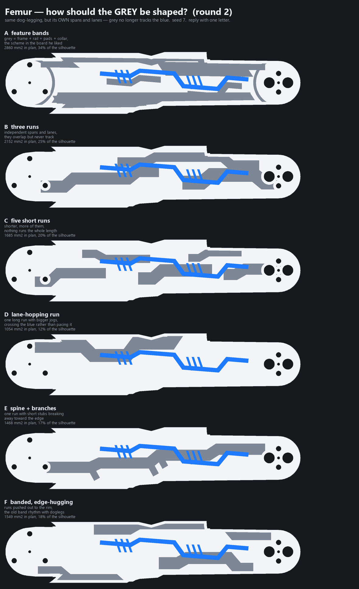

**Chose:** B -- three independent runs, own spans and lanes, seed 7, 25% grey

**Said:** TWO ROUNDS. ROUND 1 offered six greys all drawn on the blue's own routed path at a constant offset, and he rejected the lot for the same reason: 'the gray line was following the blue almost exactly. It needs to be a little bit more random, but we still did the same dog-legging kind of thing.' He attached an OLDER BOARD of this project as the counter-example, 'because it's not as following one line after the other'. WHAT THAT OLDER BOARD ACTUALLY SHOWS, and it is the whole lesson: its grey is not a trace at all. It is the FEATURE BANDS -- frame, rail, pads, the hip collar -- which already sit at different lanes, run different lengths and stop in different places. The staggered rhythm is what he responds to, and it has NO relationship to the blue. Round 1 had given grey the right vocabulary and then chained it to the wrong thing. ROUND 2 kept the dog-legging and threw away the constant offset: every run gets its own span, lane and jog positions from a seeded router. HE CHOSE B -- three independent runs, 2152 mm2, 25% of the silhouette, seed 7. They overlap the blue's territory but never track it. Reproducible from the seed, which is printed on the board and stored in the spec, so the chosen arrangement can be rebuilt exactly rather than re-rolled by accident. THE STRUCTURAL CHANGE THIS FORCES, and it is the real content of the decision. Graphite has never been a SHAPE in this pipeline: the colour split is a Z PLANE, white is the cap above it and graphite is simply whatever is left. That is why grey reads as camouflage, why it has no path or direction, and why the back was covered in rectangles -- they were whatever the plane happened to slice. Grey is now DRAWN in plan and applied as a surface inlay on BOTH faces (his choice over full depth), so white/graphite proportions fall out of the geometry instead of being solved for. CONSEQUENCES WORTH KEEPING. (a) `white_share` and its bisection become inert -- there is no plane left to solve for, so the share is REPORTED, not targeted. (b) The back needs no special treatment any more: the same inlay lands on both faces, so constraint 6 is answered by construction rather than by the graphite skin and trapezoid islands of decision 30, which are now superseded and removed. The back CONTOUR GROOVES stay -- they are geometry, not colour. (c) Nothing is cut or added, only recoloured, so the topology and thin-wall results must come out unchanged; if they move, something else broke. INLAY DEPTH is set explicitly at 3.5 mm rather than being left to fall out of a plane intersection. The number is chosen against the shallowest feature it has to survive: pockets are 2.1 mm deep, so 3.5 leaves 1.4 mm of graphite under a pocket floor -- about three extrusion widths. The sub-millimetre skins removed earlier today ran 0.13 to 0.50 mm, and the difference between those and this is that this one was chosen.

---
