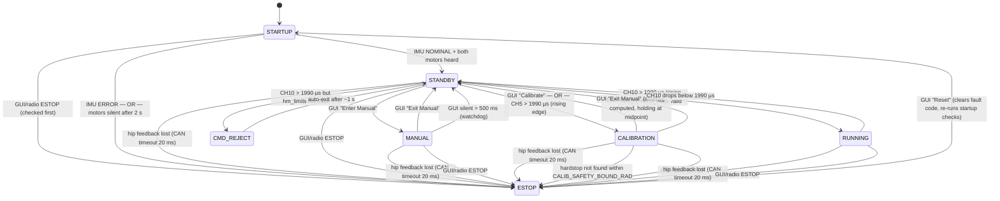

# State Machine

> **Boot note:** Before the state machine starts, `setup()` plays a C5-E5-G5 chime and a 7-step rainbow LED flash (~1.3 s). The state machine does not exist yet during this window.

> **Hidden ESTOP path:** an out-of-bounds param write (`ParamSetResult::FAULT`) pre-sets `fault_code = FAULT_PARAM_OUT_OF_BOUNDS` then calls `stateMachine_request_estop()` — can trigger ESTOP from **any** state.

## States

| State | LED | Description |
|---|---|---|
| STARTUP | white breathe | IMU + hip motor init. Waits for IMU NOMINAL and both motors to reply on CAN. |
| STANDBY | amber breathe | MIT keepalive active (zero-torque ping every loop). No torque output. |
| CALIBRATION | blue breathe | Hardstop sweep per hip (see below). Sets `hm_limits_{L,R}.valid` on success. |
| RUNNING | green blink | Balance control active. Entered via CH10 arm only if both hip limits are valid. |
| MANUAL | cyan breathe | Direct hip command dispatch from GUI. No keepalive — GUI owns CAN frames. |
| CMD_REJECT | red blink (300 ms) | ~1 s transient. Plays reject melody. Returns to STANDBY automatically. |
| ESTOP | red blink (100 ms) | All hip output stopped (if PARAM_ESTOP_HIP_DISABLE). Only exit: GUI Reset. |

## Radio triggers (all require `ibus.alive()`)

| Channel | Condition | Action | Guard |
|---|---|---|---|
| CH10 | > 1990 µs rising edge | → RUNNING | `hm_limits_L.valid && hm_limits_R.valid`; else → CMD_REJECT |
| CH10 | drops ≤ 1990 µs | → STANDBY | only from RUNNING |
| CH5  | > 1990 µs rising edge | → CALIBRATION | only from STANDBY |
| CH3  | 1000–2000 µs | sets PARAM_RADIO_HIP_CMD ∈ [0,1] | any state (left stale on signal loss) |

## Buzzer melodies

| Event | Notes | Description |
|---|---|---|
| RUNNING entry | G5 → D6 | Rising fifth: "armed" |
| STANDBY entry from RUNNING | D6 → G5 | Falling fifth: "safe" / disarmed |
| CMD_REJECT entry | C4 → G3 | Low descending: "denied" |
| Radio signal acquired | E5 | Single beep: "link up" |
| Radio signal lost | E4 → C4 | Descending: "link lost" |
| CALIBRATION start | A4 → E5 | Start chime |
| Each hardstop found | C6 / E6 | Single beep per axis |
| Calibration done | C5 → E5 → G5 | Rising arpeggio |
| Calibration fault | C4 → G3 | Low descending |

## CALIBRATION detail

Per hip (L and R run sequentially via a single state machine):

1. **SEEK_BOTTOM** — gentle MIT position ramp toward hardstop. Stall = `|Δpos|` small + `|current| > 0.5 A` for 15 ticks → zero encoder.
2. **SEEK_TOP** — ramp toward opposite hardstop. Stall detected same way → record limit.
3. **compute limits** — `hm_limits_{L,R}` set with `±CALIB_MARGIN_RAD` inset from raw hardstops.
4. **RETURN_HOME** — move to midpoint of calibrated range.
5. **DONE** — sets `hm_limits_{L,R}.valid = true`. Both hips must complete before transitioning to STANDBY.

On STANDBY entry after calibration (or abort): `calibration_abort()` is called to reset the calibration sub-state-machine, then `hip_motors_clear_setpoints()` reverts to zero-torque ping. `g_state.cmd_l` and `g_state.cmd_r` are cleared to 0 (removes calibration ramp echo from telemetry).

## RUNNING detail

On every tick:
1. `hip_cmd_to_setpoints(PARAM_RADIO_HIP_CMD, &pos_L, &pos_R)` — maps radio CH3 [0,1] to calibrated hip positions.
2. MIT setpoints sent to both motors: `kp = 5.0 N·m/rad`, `kd = 0.5 N·m·s/rad`, `tff = 0.0 N·m`.
3. `g_state.cmd_l / cmd_r` echoed to telemetry.

Obstacle avoidance (ToF) is stubbed out in code — not yet active. When enabled, it will clamp `v_ref` to zero if the front/rear ToF reading is within threshold (400 mm front, 300 mm rear) and the robot is heading toward the obstacle.

On entry: plays ARMED_MELODY.  
On exit to STANDBY: plays DISARMED_MELODY (triggered in `on_standby()`).

## MANUAL detail

1. GUI sends `CMD_ID_SET_MODE / STATE_MANUAL`
2. `on_command()` sets `s_req_manual = true`
3. Next `stateMachine_update()` (~2 ms) fires `req_manual()` → `on_manual()`
4. `on_manual()` dispatches `g_hip_cmd` if pending (ENABLE / DISABLE / ZERO / MIT)
5. Keepalive CAN frames stop — GUI must send MIT cmds each loop
6. `hip_motors_poll()` still re-enters MIT every ~4 s as safety net
7. `standby_hip_fault()` checked every tick → ESTOP if CAN silent > 20 ms
8. **GUI watchdog**: any `COMM_TYPE_COMMAND` packet resets a 500 ms timer. If the timer expires (GUI crash / disconnect), auto-exits to STANDBY. Timer is reset fresh on MANUAL entry.

## ESTOP detail

- On entry: flushes all pending mode requests (`s_req_manual`, `s_req_running`, `s_req_calibration`, `s_req_cmd_reject`) so stale queued requests cannot fire after a later STARTUP → STANDBY sequence.
- On entry: if `PARAM_ESTOP_HIP_DISABLE == 1`, calls `hip_motors_exit_mit()` and sets `s_estop_hip_disabled = true`. Logs `fault_code` as hex.
- On reset → STARTUP: if `s_estop_hip_disabled` and `PARAM_ESTOP_HIP_DISABLE >= 0.5f`, re-enters MIT automatically.
- `fault_code` is set before entering ESTOP (see `FAULT_*` in `comm_protocol.h`). `req_estop()` only sets `FAULT_HUMAN_ESTOP` if `fault_code` is still `FAULT_NONE` — callers may pre-set a more specific code.

## Fault codes

| Code | Trigger |
|---|---|
| `FAULT_NONE` | No fault |
| `FAULT_IMU_ERROR` | IMU entered ERROR state during STARTUP |
| `FAULT_HIP_INIT_TIMEOUT` | One or both motors never replied within 2 s of boot |
| `FAULT_HIP_FEEDBACK_LOST` | CAN feedback timeout in STANDBY / MANUAL / CALIBRATION / RUNNING |
| `FAULT_CALIBRATION_TIMEOUT` | Hardstop not found within `CALIB_SAFETY_BOUND_RAD` |
| `FAULT_HUMAN_ESTOP` | ESTOP triggered by GUI button or radio |
| `FAULT_PARAM_OUT_OF_BOUNDS` | Param write rejected — value outside `[min, max]` |
