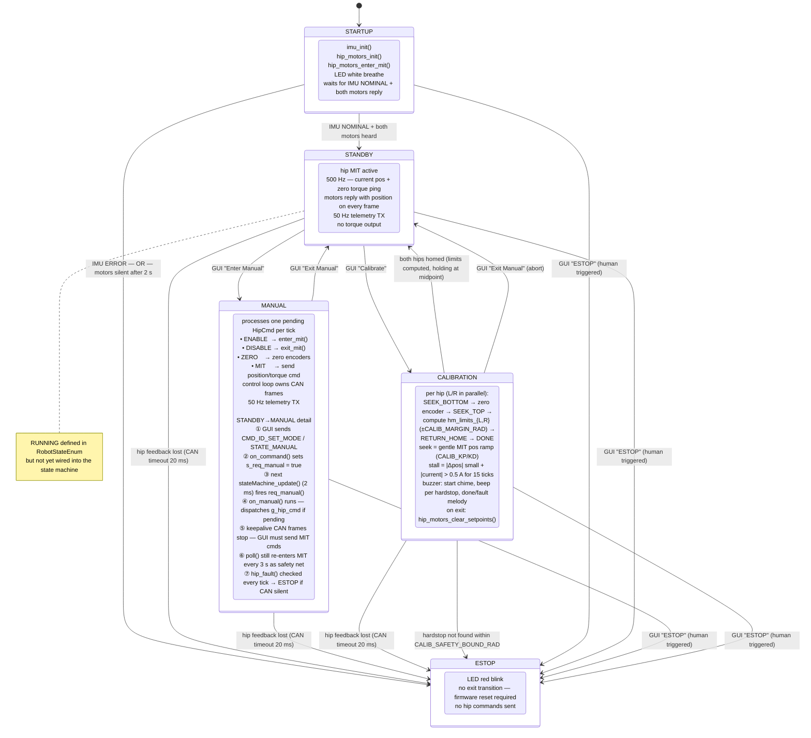

# State Machine

```mermaid
stateDiagram-v2
    [*] --> STARTUP

    STARTUP --> STANDBY : IMU NOMINAL + both motors heard
    STARTUP --> ESTOP   : IMU ERROR — OR — motors silent after 2 s

    STANDBY --> ESTOP   : hip feedback lost (CAN timeout 20 ms)
    STANDBY --> MANUAL  : GUI "Enter Manual"
    STANDBY --> CALIBRATION : GUI "Calibrate"
    MANUAL  --> ESTOP   : hip feedback lost (CAN timeout 20 ms)
    MANUAL  --> STANDBY : GUI "Exit Manual"

    CALIBRATION --> ESTOP   : hip feedback lost (CAN timeout 20 ms)
    CALIBRATION --> ESTOP   : hardstop not found within CALIB_SAFETY_BOUND_RAD
    CALIBRATION --> STANDBY : both hips homed (limits computed, holding at midpoint)
    CALIBRATION --> STANDBY : GUI "Exit Manual" (abort)

    STARTUP     --> ESTOP   : GUI "ESTOP" (human triggered)
    STANDBY     --> ESTOP   : GUI "ESTOP" (human triggered)
    MANUAL      --> ESTOP   : GUI "ESTOP" (human triggered)
    CALIBRATION --> ESTOP   : GUI "ESTOP" (human triggered)

    state STARTUP {
        direction LR
        s1 : imu_init()<br/>hip_motors_init()<br/>hip_motors_enter_mit()<br/>LED white breathe<br/>waits for IMU NOMINAL + both motors reply
    }

    state STANDBY {
        direction LR
        s2 : hip MIT active<br/>500 Hz — current pos + zero torque ping<br/>motors reply with position on every frame<br/>50 Hz telemetry TX<br/>no torque output
    }

    state CALIBRATION {
        direction LR
        s5 : per hip (L/R in parallel):<br/>SEEK_BOTTOM → zero encoder → SEEK_TOP →<br/>compute hm_limits_{L,R} (±CALIB_MARGIN_RAD) →<br/>RETURN_HOME → DONE<br/>seek = gentle MIT pos ramp (CALIB_KP/KD)<br/>stall = |Δpos| small + |current| > 0.5 A for 15 ticks<br/>buzzer: start chime, beep per hardstop, done/fault melody<br/>on exit: hip_motors_clear_setpoints()
    }

    state MANUAL {
        direction LR
        s3 : processes one pending HipCmd per tick<br/>• ENABLE  → enter_mit()<br/>• DISABLE → exit_mit()<br/>• ZERO    → zero encoders<br/>• MIT     → send position/torque cmd<br/>control loop owns CAN frames<br/>50 Hz telemetry TX<br/><br/>STANDBY→MANUAL detail<br/>① GUI sends CMD_ID_SET_MODE / STATE_MANUAL<br/>② on_command() sets s_req_manual = true<br/>③ next stateMachine_update() (2 ms) fires req_manual()<br/>④ on_manual() runs — dispatches g_hip_cmd if pending<br/>⑤ keepalive CAN frames stop — GUI must send MIT cmds<br/>⑥ poll() still re-enters MIT every 3 s as safety net<br/>⑦ hip_fault() checked every tick → ESTOP if CAN silent
    }

    state ESTOP {
        direction LR
        s4 : LED red blink<br/>no exit transition — firmware reset required<br/>no hip commands sent
    }

    note right of STANDBY : RUNNING defined in RobotStateEnum<br/>but not yet wired into the state machine
```
