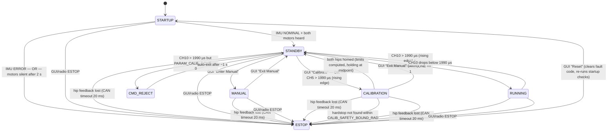

# State Machine

## States

| State | LED | Description |
|---|---|---|
| STARTUP | white breathe | IMU + hip motor init. Waits for IMU NOMINAL and both motors to reply on CAN. |
| STANDBY | amber breathe | MIT keepalive active (zero-torque ping every loop). No torque output. |
| CALIBRATION | blue breathe | Hardstop sweep per hip (see below). Sets PARAM_CALIB_DONE = 1 on success. |
| RUNNING | green blink | Balance control active. Entered via CH10 arm only if calibrated. |
| MANUAL | cyan breathe | Direct hip command dispatch from GUI. No keepalive — GUI owns CAN frames. |
| CMD_REJECT | red blink (300 ms) | ~1 s transient. Plays reject melody. Returns to STANDBY automatically. |
| ESTOP | red blink (100 ms) | All hip output stopped (if PARAM_ESTOP_HIP_DISABLE). Only exit: GUI Reset. |

## Radio triggers (all require `ibus.alive()`)

| Channel | Condition | Action | Guard |
|---|---|---|---|
| CH10 | > 1990 µs rising edge | → RUNNING | PARAM_CALIB_DONE == 1; else → CMD_REJECT |
| CH10 | drops ≤ 1990 µs | → STANDBY | only from RUNNING |
| CH5  | > 1990 µs rising edge | → CALIBRATION | only from STANDBY |
| CH3  | 1000–2000 µs | sets PARAM_RADIO_HIP_CMD ∈ [0,1] | any state (left stale on signal loss) |

## CALIBRATION detail

Per hip (L and R run sequentially via a single state machine):

1. **SEEK_BOTTOM** — gentle MIT position ramp toward hardstop. Stall = `|Δpos|` small + `|current| > 0.5 A` for 15 ticks → zero encoder.
2. **SEEK_TOP** — ramp toward opposite hardstop. Stall detected same way → record limit.
3. **compute limits** — `hm_limits_{L,R}` set with `±CALIB_MARGIN_RAD` inset from raw hardstops.
4. **RETURN_HOME** — move to midpoint of calibrated range.
5. **DONE** — sets `PARAM_CALIB_DONE = 1`. Both hips must complete before transitioning to STANDBY.

Buzzer: start chime → beep per hardstop found → done melody (or fault melody on timeout/ESTOP).  
On STANDBY entry after calibration: `hip_motors_clear_setpoints()` reverts to zero-torque ping.

## MANUAL detail

1. GUI sends `CMD_ID_SET_MODE / STATE_MANUAL`
2. `on_command()` sets `s_req_manual = true`
3. Next `stateMachine_update()` (~2 ms) fires `req_manual()` → `on_manual()`
4. `on_manual()` dispatches `g_hip_cmd` if pending (ENABLE / DISABLE / ZERO / MIT)
5. Keepalive CAN frames stop — GUI must send MIT cmds each loop
6. `hip_motors_poll()` still re-enters MIT every ~4 s as safety net
7. `standby_hip_fault()` checked every tick → ESTOP if CAN silent > 20 ms

## ESTOP detail

- On entry: if `PARAM_ESTOP_HIP_DISABLE == 1`, calls `hip_motors_exit_mit()` and sets `s_estop_hip_disabled = true`.
- On reset → STARTUP: if `s_estop_hip_disabled`, re-enters MIT automatically.
- `fault_code` is set before entering ESTOP (see `FAULT_*` in `comm_protocol.h`).

## Fault codes

| Code | Trigger |
|---|---|
| `FAULT_NONE` | No fault |
| `FAULT_IMU_ERROR` | IMU entered ERROR state during STARTUP |
| `FAULT_HIP_INIT_TIMEOUT` | One or both motors never replied within 2 s of boot |
| `FAULT_HIP_FEEDBACK_LOST` | CAN feedback timeout in STANDBY / MANUAL / CALIBRATION / RUNNING |
| `FAULT_CALIBRATION_TIMEOUT` | Hardstop not found within `CALIB_SAFETY_BOUND_RAD` |
| `FAULT_HUMAN_ESTOP` | ESTOP triggered by GUI or radio |
